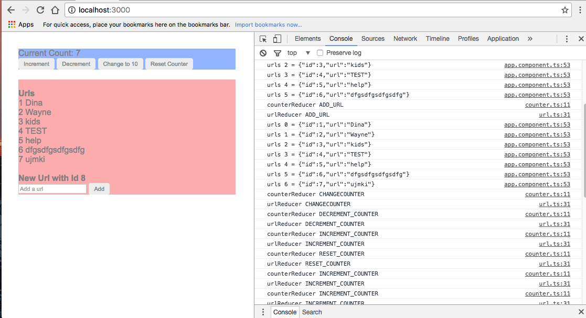
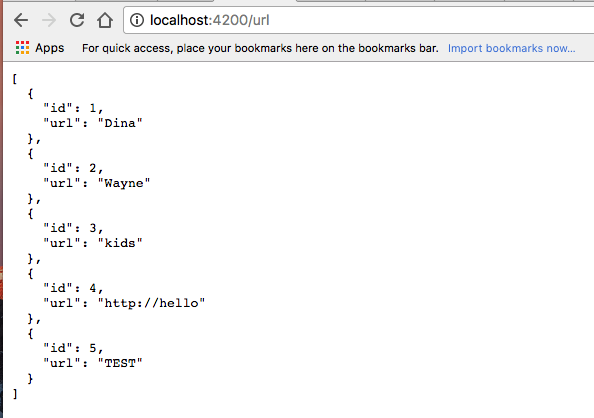

# Ngrx Example
This repository shows both the counter example found on the [NGRX repo](https://github.com/ngrx/store) as 
well as an http data example. 

## Install 
```
npm install
npm start
```
## Usage

Client-side: NG 2 example of using NGRX on port 3000

```
http://localhost:3000
```



Server-side: Json-server on port 4200 for ./db.json

```
http://localhost:4200
```



##helpful blogs:

[*Build a Better Angular 2 Application with Redux and ngrx](http://onehungrymind.com/build-better-angular-2-application-redux-ngrx/)
[https://egghead.io/lessons/angular-2-ngrx-store-in-10-minutes](https://egghead.io/lessons/angular-2-ngrx-store-in-10-minutes)
[https://github.com/btroncone/ngrx-examples](https://github.com/btroncone/ngrx-examples)
[https://gist.github.com/btroncone/a6e4347326749f938510#actions](https://gist.github.com/btroncone/a6e4347326749f938510#actions)
[https://www.youtube.com/watch?v=mhA7zZ23Odw](https://www.youtube.com/watch?v=mhA7zZ23Odw)
[http://stackoverflow.com/questions/39593151/how-to-configure-system-config-js-for-ngrx-store-2-2-1](http://stackoverflow.com/questions/39593151/how-to-configure-system-config-js-for-ngrx-store-2-2-1)

##example repos:

[https://github.com/ngrx/example-app.git](https://github.com/ngrx/example-app.git)
[https://github.com/btroncone/ngrx-examples](https://github.com/btroncone/ngrx-examples)
[https://github.com/onehungrymind/fem-ng2-ngrx-app](https://github.com/onehungrymind/fem-ng2-ngrx-app)